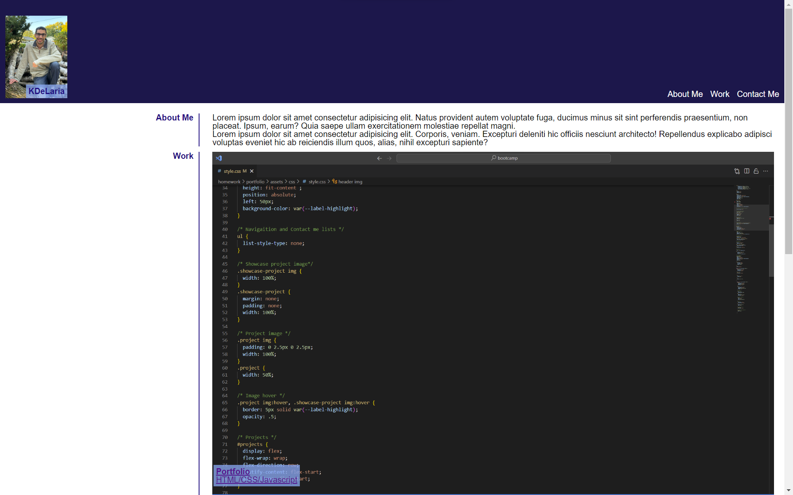

# KDeLaria Webpage

Visit the [KDeLaria Webpage](https://kdelaria.github.io/portfolio/).

## Description

 This webpage was designed to show the user the projects that KDeLaria has made.

## Installation

N/A

## Usage

Click on the navigation links to navigate to a specific section or to contact the developer.

## Credits

*“Picture of man writing a note” Picsum, *[fastly.picsum.photos/id/4/5000/3333.jpg?hmac=ghf06FdmgiD0-G4c9DdNM8RnBIN7BO0-ZGEw47khHP4](https://fastly.picsum.photos/id/4/5000/3333.jpg?hmac=ghf06FdmgiD0-G4c9DdNM8RnBIN7BO0-ZGEw47khHP4)*. Accessed 16 Dec. 2023.*

*"CSS Styling Images." W3Schools, *[w3schools.com/css/css3_images.asp](https://www.w3schools.com/css/css3_images.asp)*. Accessed 16 Dec, 2023.*

*"HTML main Tag." W3Schools, *[w3schools.com/css/css3_flexbox_container.asp](https://www.w3schools.com/css/css3_flexbox_container.asp)*.  Accessed 16 Dec, 2023.*

*"CSS Visibility Property." W3Schools, *[w3schools.com/css/css3_flexbox_container.asp](https://www.w3schools.com/css/css3_flexbox_container.asp)*.  Accessed 16 Dec, 2023.*

*"Markdown Cheat Sheet." Markdown Guide, Matt Cone, *[markdownguide.org/cheat-sheet/](https://www.markdownguide.org/cheat-sheet/)*. Accessed 13 Dec, 2023.*

## License
N/A